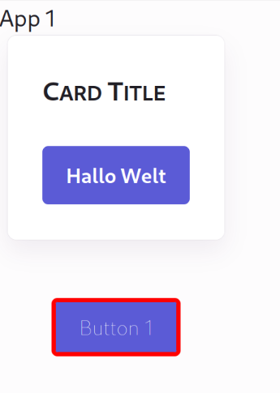

# Park UI Monorepo

Example of a monorepo using Park UI.

Since Park UI uses Panda CSS under the hood, I followed
https://panda-css.com/docs/guides/component-library#include-the-src-files

and created separate workspace packages:

* `packages/components/` - shared components, 
  contains Park UI and custom components using Park UI
* `packages/panda-preset/` - custom Panda Preset, 
  see https://panda-css.com/docs/guides/component-library#ship-a-panda-preset
* `packages/styled-system/` - Panda as external package, 
  see https://panda-css.com/docs/guides/component-library#use-panda-as-external-package

 * `app/app1/` - example app  
   using Park UI and custom components based on Park UI.

The Park UI components were imported using:
                     
```bash
  npx @park-ui/cli@0.6.0 init
  npx @park-ui/cli@0.6.0 add card button
```

As a post-processing I had to 

* replace the `styled-system` imports with imports from `@park-ui-monorepo/styled-system`.                
* change imports using an alias lik `~/ui` into relative paths, e.g. `../ui`

Diff of the changes:

```diff
diff --git b/packages/components/src/ui/button.tsx a/packages/components/src/ui/button.tsx
index a6be97e..2adb351 100644
--- b/packages/components/src/ui/button.tsx
+++ a/packages/components/src/ui/button.tsx
@@ -1,8 +1,8 @@
 import type { Assign } from '@ark-ui/react'
 import { type HTMLArkProps, ark } from '@ark-ui/react/factory'
-import { styled } from 'styled-system/jsx'
-import { type ButtonVariantProps, button } from 'styled-system/recipes'
-import type { JsxStyleProps } from 'styled-system/types'
+import { styled } from '@park-ui-monorepo/styled-system/jsx'
+import { type ButtonVariantProps, button } from '@park-ui-monorepo/styled-system/recipes'
+import type { JsxStyleProps } from '@park-ui-monorepo/styled-system/types'
 
 export interface ButtonProps
   extends Assign<JsxStyleProps, HTMLArkProps<'button'>>,
diff --git b/packages/components/src/ui/card.tsx a/packages/components/src/ui/card.tsx
index 094b02f..4aad8b9 100644
--- b/packages/components/src/ui/card.tsx
+++ a/packages/components/src/ui/card.tsx
@@ -1,8 +1,8 @@
 import type { Assign } from '@ark-ui/react'
 import { type HTMLArkProps, ark } from '@ark-ui/react/factory'
-import { type CardVariantProps, card } from 'styled-system/recipes'
-import type { JsxStyleProps } from 'styled-system/types'
-import { createStyleContext } from '~/lib/create-style-context'
+import { type CardVariantProps, card } from '@park-ui-monorepo/styled-system/recipes'
+import type { JsxStyleProps } from '@park-ui-monorepo/styled-system/types'
+import { createStyleContext } from '../lib/create-style-context'
 
 const { withProvider, withContext } = createStyleContext(card)
```

# Getting the example app running

```bash
pnpm install
cd apps/app1
pnpm dev
````

Screenshot:



